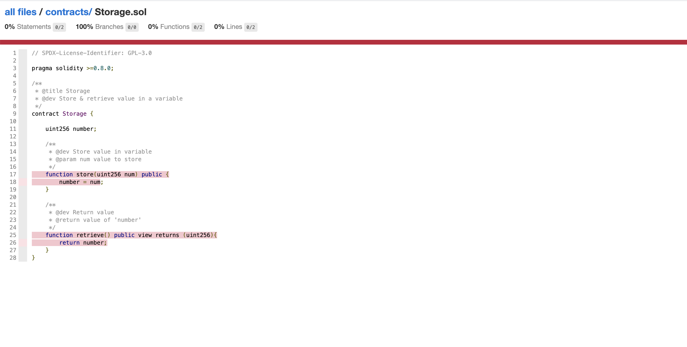

# Solidity 合约覆盖率生成方法

## 原理

1. 用 solidity-coverage 的 api 在合约代码中插桩，在经 solidity-compiler 编译成字节码
2. 部署插桩后的合约到内置的 ganache 中，ganache 会记录插桩后合约的代码执行明细
3. 启动 express 服务, 将 / 反向代理到 ganache, 当收到 /coverage.x 请求后调 solidity-coverage 的 api 生成报告，重定向到报告页面


## 效果图




## 生成步骤

1. 从 yongyang2021/solidity-coverage-example 镜像启动服务端

   服务端监听的端口默认是 3000, 可以通过 PORT 环境变量修改

   可以映射配置文件 ganache.json 到 /app/ganache.json 覆盖 ganache 的配置

   如下 ganache.json 文件配置了一个开发者账号和数据持久化目录


   ```json
    {
        "accounts": [
            {
                "secretKey": "*****",
                "balance": "0x845951614014880000000"
            }
        ],
        "db_path": "/app/database"    
    }   
   ```


   docker-compose.yml 文件:

    ```yml
    version: '2'
    services:
    cov_server:
        image: 'yongyang2021/solidity-coverage-example:v0.0.4'
        ports: 
        - 3001:3001
        volumes:   
        - ganache.json:/app/ganache.json
        - database:/app/database
        environment:
        - PORT=3001
    ```    
        
2. 利用 docker 容器部署合约到刚才启动的服务端

   1. 配置环境变量 COV_HOST=192.168.1.1, 这里不建议填写 localhost，因为 docker 容器默认不是 host 模式, mac 用户需要填 host.docker.internal
   2. 配置环境变量 COV_PORT=3001, 这里对应服务端的 IP
   3. 配置环境变量 COV_KEY=**, 填写开发者账号
   4. 映射 local 文件夹到容器中，接受部署合约完成后的地址
   5. 映射 artifacts 接收 abi 文件

   docker-compose.yml 文件:

    ```yml
    version: '2'
    services:
    cov_client:
        image: 'yongyang2021/solidity-coverage-example:v0.0.4'
        volumes:   
        - local:/app/local
        - artifacts:/app/artifacts
        environment:
        - COV_HOST=192.168.1.1
        - COV_PORT=3001
        - COV_KEY=**        
        entrypoint: 'npm run cov-deploy'
    ```  

3. 第2步的容器停止后，完成后访问 ```http://localhost:3001/coverage.x```， 可以看到合约的构造器已经被调用过一次